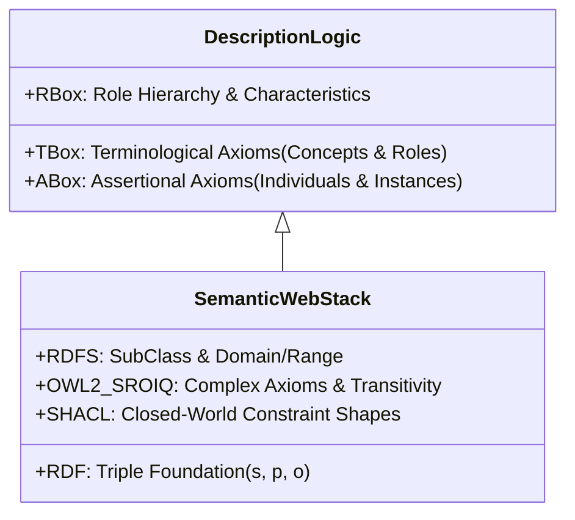
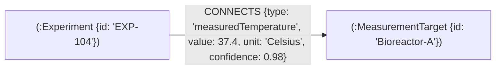
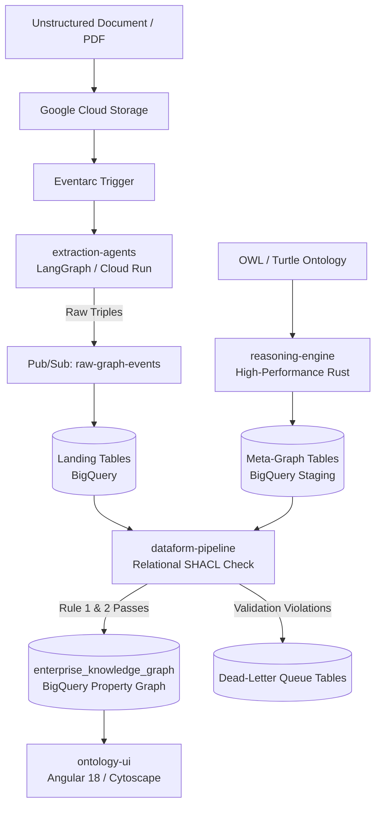

# Neuro-Symbolic Knowledge Platform
> *A deterministic, mathematically-grounded neuro-symbolic platform bridging Generative AI and Enterprise Knowledge Graphs.*

---

## Prologue: Formal Systems, Meaning, and *Gödel, Escher, Bach*

As a teenager reading Douglas Hofstadter's *Gödel, Escher, Bach: an Eternal Golden Braid* (GEB), I was captivated by a central question of cognition and logic: **How does meaning emerge from meaningless typographical rules?**

In GEB, Hofstadter introduces the **MIU-system**—a toy formal system governed by mechanical rewrite rules ($\text{MI} \to \text{MIU}$, $\text{Mx} \to \text{Mxx}$, etc.). The symbols themselves have no inherent awareness of reality. Yet, when a formal system's internal theorems map one-to-one with facts in an external domain, an **isomorphism** is born. *Meaning* is not inside the tokens; meaning is the invariant structure maintained across that isomorphism.

```
       [ Ungrounded Syntax ]                 [ External Reality ]
      (Statistical Word Vectors)            (Enterprise Facts & Logic)
                  \                                  /
                   \                                /
                    ▼                              ▼
                 ┌────────────────────────────────────┐
                 │       ISOMORPHISM / ONTOLOGY       │
                 │   Invariant Topological Structure  │
                 └────────────────────────────────────┘
```

Decades later, the artificial intelligence industry faces this exact Hofstadterian dilemma with Large Language Models. Modern LLMs are masterful symbol manipulators—statistical engines that excel at syntactic fluency. However, without a formal axiomatic anchor, they are ungrounded. In formal logic terms, **a hallucination is simply a topological violation of an isomorphism.**

The **Neuro-Symbolic Knowledge Platform** was created to restore this isomorphism. It marries the intuitive, unstructured semantic synthesis of LLMs with the deterministic mathematical rigidity of **Formal Ontologies and Description Logics**.

---

## 1. The Foundations: What is an Ontology?

An **Ontology** is a formal, explicit specification of a shared conceptualization. Far beyond a database schema or a taxonomy, an ontology provides a machine-interpretable, axiomatic definition of a domain using **Description Logics (DL)**.



### The Formal Logic Spectrum
Ontological systems trace their lineage from Aristotle's categories, through semantic networks and frame systems (Minsky, 1974), to modern expressive Description Logics:
* **$\mathcal{ALC}$** (Attributive Concept Language with Complements)
* **$\mathcal{SHOIN}(D)$** (The foundation of OWL 1 DL)
* **$\mathcal{SROIQ}(D)$** (The theoretical foundation of **OWL 2 DL**)

In an OWL 2 DL ontology, knowledge is split into:
1. **$\text{TBox}$ (Terminological Knowledge):** Axioms defining universal concepts, subsumption hierarchies ($C \sqsubseteq D$), and role restrictions ($\exists R.C$, $\forall R.C$).
2. **$\text{ABox}$ (Assertional Knowledge):** Concrete assertions about individual instances ($a : C$, $(a, b) : R$).
3. **$\text{RBox}$ (Role Knowledge):** Property hierarchies, transitivity, symmetry, and inverse property definitions ($R \circ S \sqsubseteq P$).

### The Open World vs. Closed World Tension
Classic Semantic Web tooling operates under the **Open World Assumption (OWA)**: the absence of a statement does not imply it is false, merely unknown. While ideal for distributed scientific discovery, enterprise data analytics requires the **Closed World Assumption (CWA)**—if an extracted fact violates known schema constraints, it must be rejected. 

The platform resolves this tension by utilizing **SHACL (Shapes Constraint Language)** converted into **Relational Set Operations** within high-scale analytical databases.

---

## 2. The AI Problem: Why LLMs Need Ontologies

```
┌────────────────────────────────────────┐     ┌────────────────────────────────────────┐
│     Stochastic Extraction (LLM)        │     │    Deterministic Validation (SHACL)    │
│ • Probabilistic Next-Token Generation  │ ──► │ • Exact Graph Path Matching (GQL)      │
│ • High Recall from Unstructured Text   │     │ • Zero Hallucination Guarantee         │
│ • Prone to Topological Hallucination   │     │ • Mathematical Domain/Range Check      │
└────────────────────────────────────────┘     └────────────────────────────────────────┘
```

Modern enterprise AI pipelines attempt to solve factual grounding using **Vector Search (RAG)**. However, cosine similarity in a high-dimensional embedding space only measures *semantic relatedness*, not *logical validity*:
* Vector search cannot detect if an extracted dosage violates the formal range of an active pharmaceutical ingredient.
* Vector search cannot prevent an LLM from inventing a non-existent relationship edge between two valid entity nodes.

### The Platform's Mathematical Paradigm
Rather than asking an LLM to "verify" its own output, the platform treats ontology validation as a **pure relational algebra problem**:

1. **Meta-Graph Materialization:** The ontology ($\text{TBox}$) is pre-compiled into an empty directed graph of valid topological paths:
   $$\mathcal{G}_{\text{meta}} = \langle \mathcal{C}, \mathcal{R} \rangle \quad \text{where } (C_i, r, C_j) \in \mathcal{R} \iff \text{Domain}(r) = C_i \land \text{Range}(r) = C_j$$
2. **Deterministic Extraction:** LLM agents (LangGraph) extract candidate $\text{ABox}$ assertions:
   $$\tau_{\text{cand}} = (s, c_s, p, o, c_o)$$
3. **Relational SHACL Enforcement (BigQuery):** The candidate triples are joined against the Meta-Graph:
   $$\tau_{\text{valid}} = \tau_{\text{cand}} \bowtie_{\substack{\text{LOWER}(c_s) = \text{LOWER}(C_i) \\ \text{LOWER}(p) = \text{LOWER}(r) \\ \text{LOWER}(c_o) = \text{LOWER}(C_j)}} \mathcal{G}_{\text{meta}}$$
   Any assertion where the inner join fails is mathematically isolated and routed to a **Dead-Letter Queue (DLQ)**.

---

## 3. The Shift to Edge Properties (LPG) & Metrology

Traditional RDF triples (`Subject-Predicate-Object`) suffer from severe modeling bloat when applied to real-world industrial datasets requiring **Metrology (Units of Measurement)**, **SKOS Concept Mapping**, and **Provenance**.

### The RDF Reification Problem
In standard RDF, attaching metadata (like a confidence score or unit of measurement) to an edge requires **RDF Reification** or **Named Graphs**, turning a single factual edge into 4–5 auxiliary nodes and edges.

```
[ Traditional RDF Reification: Node Bloat ]
(:Experiment_1) ──► (:Statement_Node) ──► (:Temperature_Node)
                         │       │
                         ▼       ▼
                     [0.95]    ["Celsius"]
```

### The Labeled Property Graph (LPG) Solution
The platform synthesizes extracted knowledge directly into a **Virtual Labeled Property Graph** using ISO GQL standard schemas in Google BigQuery. Properties live directly on the edges:



This ensures downstream ISO GQL path traversals execute with maximum relational efficiency without graph table explosion.

---

## 4. Architecture & Submodules

The platform is structured into five cohesive microservices linked as Git submodules:

```
neuro-symbolic-knowledge-platform/
├── extraction-agents/     ──► LangGraph AI extraction multi-agent pipeline
├── dataform-pipeline/     ──► BigQuery Dataform SQLX Relational SHACL Engine
├── ontology-ui/           ──► Angular 18 progressive Cytoscape visualizer
├── infrastructure/        ──► Terraform GCP platform definitions
└── reasoning-engine/      ──► Custom Rust OWL reasoning & materialization engine
```



### Submodule Descriptions

1. **[`extraction-agents/`](./extraction-agents)**
   * **Stack:** Python 3.11, LangGraph, Vertex AI (`gemini-3.5-flash`).
   * **Role:** Map-reduce fan-out agent that slices documents, contextualizes sections with relevant ontology slices, and outputs structured candidate triples.
2. **[`dataform-pipeline/`](./dataform-pipeline)**
   * **Stack:** Google Cloud Dataform, SQLX, BigQuery ISO GQL.
   * **Role:** Executes Rule 1 (Vocabulary Check) and Rule 2 (Topological Check) in SQL, compiling the final `enterprise_knowledge_graph`.
3. **[`ontology-ui/`](./ontology-ui)**
   * **Stack:** Angular 18, Angular Material, Cytoscape.js.
   * **Role:** Ultra-fast progressive loading visualizer (`getRoots()`, `expandNode()`) capable of exploring 100,000+ nodes without DOM latency.
4. **[`infrastructure/`](./infrastructure)**
   * **Stack:** HashiCorp Terraform.
   * **Role:** Declarative IaC provisioning Cloud Run, Eventarc, Pub/Sub topics, IAM Service Accounts, and BigQuery datasets.
5. **[`reasoning-engine/`](./reasoning-engine)**
   * **Stack:** Rust (`cargo`), Memory-safe Parallel Graph Traversal.
   * **Role:** Ultra-fast offline ontology reasoning engine built to parse massive enterprise OWL files and materialize all valid topological paths in milliseconds.

---

## 5. Getting Started

### Prerequisites
* Git with SSH authentication configured
* Google Cloud SDK (`gcloud`)
* Terraform >= 1.5.0
* Python 3.11+
* Node.js >= 20.x

### Cloning with All Submodules
```bash
git clone --recursive git@github.com:anpag/neuro-symbolic-knowledge-platform.git
cd neuro-symbolic-knowledge-platform
```

If you have already cloned without submodules:
```bash
git submodule update --init --recursive
```

### Global Commands (`Makefile`)
```bash
# Initialize all submodules
make init

# Deploy GCP platform infrastructure
make deploy-infra

# Run local agent tests
make test-agents

# Launch the visualizer locally
make serve-ui
```

---

## License & Authors
Maintained by Antonio Paulino. Dedicated to the synthesis of symbolic logic and neural computing.
